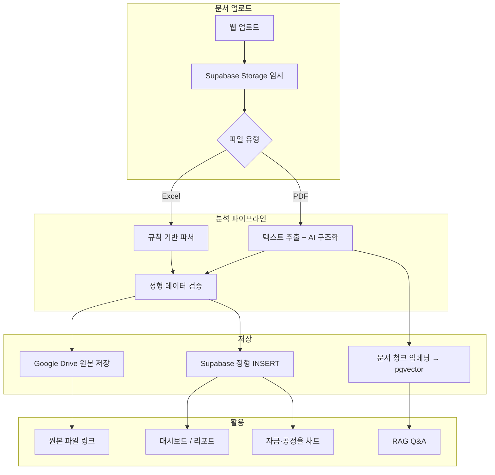
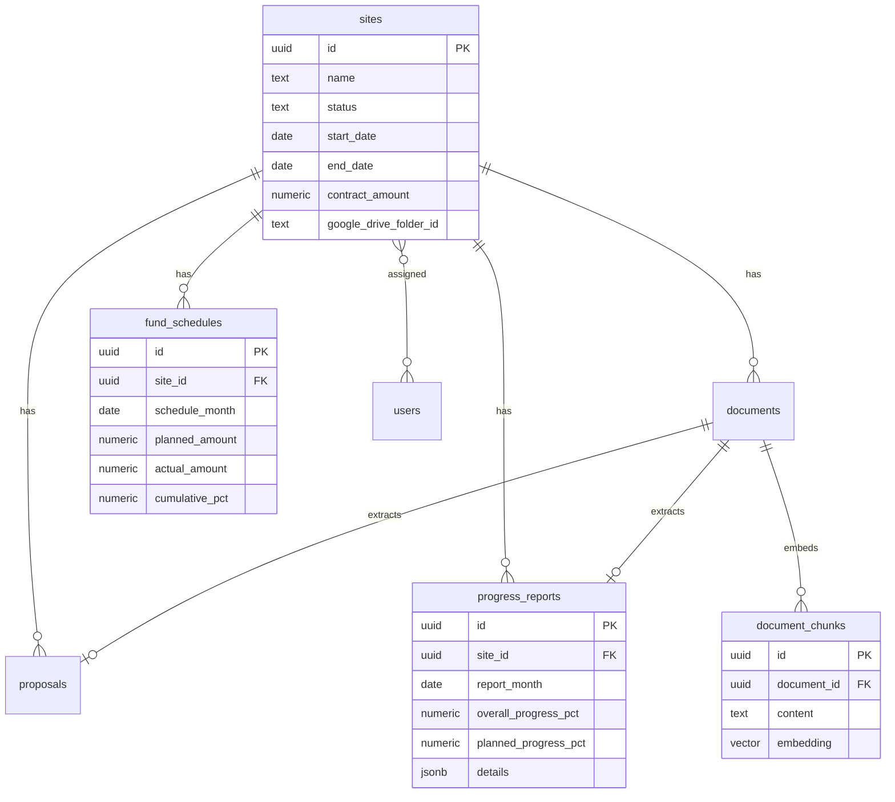

# Dumpit RE — 부동산 사업장 관리 웹앱 개발계획서

> **문서 버전:** v0.1  
> **작성일:** 2026-07-12  
> **상태:** 초안 (샘플 문서 분석 대기)

---

## 1. 프로젝트 개요

### 1.1 배경

- 전체 사업장 **50곳 이상**, 현재 **20여 곳 진행 중**
- 사업장별 **제안서**, **월별 공정율 자료** 등 문서가 대량으로 축적됨
- 문서 기반으로 **사업장 현황**, **공정율**, **자금집행**을 한곳에서 관리하고, **자연어 질의**로 정보를 조회하고자 함

### 1.2 목표

| 목표 | 설명 |
|------|------|
| **문서 중심 자동화** | 업로드 → 분석 → 정형 데이터 저장 → 대시보드 반영 |
| **원본 보존** | 분석 후 원본 파일은 Google Drive에 사업장별 보관 |
| **정형 데이터 관리** | Supabase(PostgreSQL)에 검색·집계·리포트 가능한 구조로 저장 |
| **현황 가시화** | 사업장 현황, 공정율 추이, 자금집행 스케줄을 웹에서 조회 |
| **지능형 Q&A** | "○○ 사업장 3월 공정율은?", "지연 사업장은?" 등 자연어 질의 응답 |

### 1.3 핵심 사용자

| 역할 | 주요 사용 |
|------|-----------|
| **본사 관리자** | 전체 사업장 현황, 포트폴리오 리포트, Q&A |
| **사업장 담당자** | 담당 사업장 문서 업로드, 공정율·자금 입력/확인 |
| **경영진** | 대시보드, 지연·자금 이슈 요약 |

---

## 2. 시스템 아키텍처

### 2.1 기술 스택 (권장)

```
┌──────────────────────────────────────────────────────────────────┐
│  Frontend — Vercel                                               │
│  Next.js 14+ (App Router) · TypeScript · Tailwind · shadcn/ui    │
└───────────────────────────────┬──────────────────────────────────┘
                                │
┌───────────────────────────────▼──────────────────────────────────┐
│  API Layer — Vercel Serverless Functions / Route Handlers        │
│  · 문서 업로드 · Drive 연동 · 분석 트리거 · Q&A 오케스트레이션      │
└───────┬─────────────────┬──────────────────┬─────────────────────┘
        │                 │                  │
┌───────▼───────┐ ┌───────▼───────┐ ┌────────▼────────────────────┐
│  Supabase     │ │ Google Drive  │ │  AI Services                │
│  · PostgreSQL │ │ · 원본 보관    │ │  · 문서 구조화 추출          │
│  · Auth       │ │ · 폴더 구조    │ │  · RAG Q&A (임베딩+LLM)     │
│  · pgvector   │ │               │ │  · OpenAI / Claude API      │
│  · Storage    │ │               │ │                             │
│    (임시)     │ │               │ │                             │
└───────────────┘ └───────────────┘ └─────────────────────────────┘
```

### 2.2 스택 선정 이유

| 영역 | 선택 | 이유 |
|------|------|------|
| 배포 | **Vercel** | Next.js 최적화, CI/CD 간단, Serverless API |
| DB | **Supabase** | 관계형 SQL(집계·리포트), Auth, pgvector(RAG), Realtime |
| 원본 저장 | **Google Drive** | 기존 업무 흐름과 호환, 폴더 공유·링크 접근 용이 |
| AI | Claude / GPT API | PDF 제안서 추출, Q&A, 비정형 문서 대응 |

> Firebase는 Auth·Hosting에 강하지만, **50+ 사업장 × 월별 공정율·자금 집계**에는 PostgreSQL(Supabase)이 유리합니다.

### 2.3 데이터 흐름



---

## 3. 기능 명세

### 3.1 Phase 1 — MVP (핵심 관리)

#### 3.1.1 사업장 관리

- 사업장 CRUD (이름, 주소, 상태, 계약금액, 공사기간)
- 상태: `planned` | `in_progress` | `completed` | `suspended`
- Google Drive 루트 폴더 하위 **사업장별 폴더** 자동 생성
- 담당자 배정 (user ↔ site 다대다)

#### 3.1.2 문서 업로드·분석

| 문서 유형 | 코드 | 추출 목표 |
|-----------|------|-----------|
| 제안서 | `proposal` | 사업장명, 총 공사비, 공사기간, 주요 공종·일정 |
| 월별 공정율 | `progress_report` | 기준월, 전체/계획 공정율, 공종별 세부, 지연 여부 |
| 자금집행표 | `fund_schedule` | 월별 계획/실적 집행액, 누적 집행률 *(양식 확인 후)* |

**업로드 UX**

- 드래그앤드롭, 다중 파일
- 사업장 수동 선택 또는 파일명/내용 기반 자동 매칭
- 분석 상태: `pending` → `processing` → `done` | `failed` | `needs_review`

**저장 정책**

1. 분석 완료 후 원본 → Google Drive (`sites/{사업장명}/제안서|공정율|자금/`)
2. 메타데이터 + 추출 결과 → Supabase
3. 임시 Storage 파일 삭제 (또는 24시간 TTL)

#### 3.1.3 대시보드

- KPI: 진행 중 사업장 수, 평균 공정율, 지연 사업장 수, 당월 집행률
- 차트: 월별 포트폴리오 공정율 추이, 자금 계획 vs 실적
- 알림: 공정율 미달, 자금 집행 지연, 분석 실패 문서
- 최근 업로드·분석 대기 목록

#### 3.1.4 사업장 상세

- 기본 정보 + 제안서 요약
- 공정율 시계열 (계획 vs 실적, 공종별 drill-down)
- 업로드 문서 목록 (Google Drive 링크)
- 활동 타임라인 (문서 업로드, 공정율 갱신 이벤트)

---

### 3.2 Phase 2 — 자금집행 스케줄 관리

#### 3.2.1 개념

사업장별 **월 단위** 자금 집행 계획과 실적을 관리하고, 공정율과 함께 대시보드에 표시.

| 항목 | 설명 |
|------|------|
| **계획 집행액** | 해당 월에 집행 예정인 금액 |
| **실적 집행액** | 실제 집행된 금액 |
| **누적 집행률** | 총 사업비 대비 누적 집행 비율 |
| **공정율 연계** | 동월 공정율과 집행률 괴리(S-curve 이탈) 감지 |

#### 3.2.2 데이터 입력 경로

1. **문서 업로드** — 자금집행 엑셀/PDF 자동 파싱 *(샘플 양식 확정 후)*
2. **수동 입력** — 웹 폼에서 월별 계획/실적 수정
3. **일괄 import** — CSV/Excel 템플릿 업로드

#### 3.2.3 화면

- **사업장 상세 > 자금 탭**: 월별 테이블 + 누적 집행률 차트
- **포트폴리오 자금 뷰**: 전체 사업장 당월·분기 집행 현황
- **이상 감지**: 공정율 대비 집행 과다/과소 사업장 하이라이트

#### 3.2.4 리포트

- 사업장별 월간 자금·공정율 리포트 (PDF export, Phase 3)

---

### 3.3 Phase 3 — 사업장 Q&A (RAG)

#### 3.3.1 목표

자연어로 사업장 정보를 질의하면, **업로드된 문서 + DB 정형 데이터**를 근거로 답변.

**예시 질의**

- "강남 ○○ 사업장 올해 3월 공정율은?"
- "공정율이 70% 미만인 진행 중 사업장 알려줘"
- "A사업장 제안서상 총 공사비와 현재까지 집행액 비교해줘"
- "지난달 공정율 보고서 업로드 안 된 사업장은?"

#### 3.3.2 아키텍처 (Hybrid RAG)

```
사용자 질문
    │
    ├─► [Intent 분류]
    │       ├─ 구조화 질의 (집계/필터) → SQL Agent → Supabase
    │       └─ 비구조화 질의 (문서 내용) → Vector Search → pgvector
    │
    └─► [LLM 답변 생성] + 출처(citation) 첨부
            · DB row 참조 (site_id, report_month)
            · Google Drive 문서명 + 페이지/시트
```

| 질의 유형 | 처리 방식 |
|-----------|-----------|
| 수치·집계 ("평균 공정율", "지연 사업장 수") | SQL 생성 → PostgreSQL 실행 |
| 문서 내용 ("제안서에 명시된 공종은?") | pgvector 유사도 검색 → LLM synthesis |
| 복합 ("3월 공정율과 집행률 비교") | SQL + Vector 병행 |

#### 3.3.3 임베딩 대상

- 제안서 PDF 텍스트 (청크 단위)
- 공정율 보고서 요약 + 공종별 메모
- *(선택)* 수동 입력 메모·코멘트

#### 3.3.4 UX

- 사업장 상세 또는 전역 **채팅 패널**
- 답변 하단 **출처 링크** (DB 필드, Drive 원본)
- 대화 히스토리 저장 (사용자별)

#### 3.3.5 가드레일

- 담당 사업장 권한 밖 데이터 접근 차단 (RLS + Q&A scope filter)
- SQL Agent: 허용 테이블·컬럼 화이트리스트, read-only
- 답변 불확실 시 "문서에 명시되지 않음" 명시

---

### 3.4 Phase 4 — 고도화

- 이메일/Slack 알림 (공정율 미제출, 집행 지연)
- 역할별 대시보드 (경영진용 요약 vs 현장용 상세)
- 감사 로그 (누가 언제 어떤 데이터 수정)
- 모바일 반응형 + PWA
- 다국어 *(필요 시)*

---

## 4. 데이터 모델

### 4.1 ERD (개념)



### 4.2 Supabase 테이블 (초안)

```sql
-- 사업장
create table sites (
  id uuid primary key default gen_random_uuid(),
  name text not null,
  code text unique,                    -- 내부 코드 (선택)
  address text,
  status text not null default 'in_progress'
    check (status in ('planned','in_progress','completed','suspended')),
  start_date date,
  end_date date,
  contract_amount numeric(18,2),
  google_drive_folder_id text,
  metadata jsonb default '{}',
  created_at timestamptz default now(),
  updated_at timestamptz default now()
);

-- 문서 메타
create table documents (
  id uuid primary key default gen_random_uuid(),
  site_id uuid references sites(id),
  type text not null
    check (type in ('proposal','progress_report','fund_schedule','other')),
  file_name text not null,
  mime_type text,
  google_drive_file_id text,
  google_drive_url text,
  analysis_status text default 'pending'
    check (analysis_status in ('pending','processing','done','failed','needs_review')),
  analysis_error text,
  uploaded_by uuid references auth.users(id),
  uploaded_at timestamptz default now(),
  analyzed_at timestamptz
);

-- 제안서 추출
create table proposals (
  id uuid primary key default gen_random_uuid(),
  site_id uuid not null references sites(id),
  document_id uuid references documents(id),
  total_budget numeric(18,2),
  construction_period_months int,
  key_items jsonb,                     -- 공종, 일정 등
  raw_extract jsonb,                   -- AI 원본 출력 (디버깅)
  extracted_at timestamptz default now()
);

-- 월별 공정율
create table progress_reports (
  id uuid primary key default gen_random_uuid(),
  site_id uuid not null references sites(id),
  document_id uuid references documents(id),
  report_month date not null,          -- YYYY-MM-01
  overall_progress_pct numeric(5,2),
  planned_progress_pct numeric(5,2),
  variance_pct numeric(5,2) generated always as
    (overall_progress_pct - planned_progress_pct) stored,
  details jsonb,                       -- [{trade, actual, planned}, ...]
  notes text,
  extracted_at timestamptz default now(),
  unique (site_id, report_month)
);

-- 월별 자금집행
create table fund_schedules (
  id uuid primary key default gen_random_uuid(),
  site_id uuid not null references sites(id),
  document_id uuid references documents(id),
  schedule_month date not null,        -- YYYY-MM-01
  planned_amount numeric(18,2) not null default 0,
  actual_amount numeric(18,2),
  notes text,
  source text default 'manual'         -- manual | document | import
    check (source in ('manual','document','import')),
  updated_at timestamptz default now(),
  unique (site_id, schedule_month)
);

-- RAG용 문서 청크 (pgvector)
create extension if not exists vector;

create table document_chunks (
  id uuid primary key default gen_random_uuid(),
  document_id uuid not null references documents(id) on delete cascade,
  site_id uuid references sites(id),
  chunk_index int not null,
  content text not null,
  embedding vector(1536),              -- model에 맞게 조정
  metadata jsonb default '{}',
  created_at timestamptz default now()
);

create index on document_chunks using ivfflat (embedding vector_cosine_ops);

-- 사용자-사업장 담당
create table site_assignments (
  user_id uuid references auth.users(id),
  site_id uuid references sites(id),
  role text default 'viewer' check (role in ('viewer','editor','admin')),
  primary key (user_id, site_id)
);

-- Q&A 대화
create table chat_sessions (
  id uuid primary key default gen_random_uuid(),
  user_id uuid references auth.users(id),
  site_id uuid references sites(id),   -- null이면 전역 질의
  title text,
  created_at timestamptz default now()
);

create table chat_messages (
  id uuid primary key default gen_random_uuid(),
  session_id uuid references chat_sessions(id) on delete cascade,
  role text check (role in ('user','assistant')),
  content text not null,
  citations jsonb,                     -- [{type, id, label, url}]
  created_at timestamptz default now()
);
```

### 4.3 Row Level Security (RLS)

- `site_assignments` 기반: 담당 사업장 데이터만 SELECT/INSERT
- `admin` 역할: 전체 사업장 접근
- Q&A API: 세션 생성 시 site scope 검증

---

## 5. Google Drive 폴더 구조

```
DumpitRE/                              ← 서비스 계정 공유 루트
├── {사업장코드}_{사업장명}/
│   ├── 01_제안서/
│   ├── 02_공정율/
│   ├── 03_자금집행/
│   └── 99_기타/
└── _미분류/                            ← 자동 매칭 실패
```

- DB `sites.google_drive_folder_id` ↔ Drive folder ID 매핑
- `documents.google_drive_file_id`로 원본 바로 열기

---

## 6. 문서 분석 전략

### 6.1 하이브리드 접근 (권장)

| 파일 | 1차 | 2차 (실패 시) |
|------|-----|---------------|
| 공정율 Excel | 고정 셀/시트 규칙 파서 | AI fallback |
| 자금집행 Excel | 고정 양식 파서 | AI fallback |
| 제안서 PDF | PDF 텍스트 추출 + AI JSON | 수동 검수 큐 |

### 6.2 샘플 문서 분석 체크리스트 *(업로드 후 진행)*

- [ ] 제안서 PDF: 페이지 수, 표/본문 비율, 추출 가능 필드 목록
- [ ] 공정율 Excel: 시트명, 헤더 행, 공종별 컬럼 구조, 월 표기 방식
- [ ] 자금집행 Excel: 존재 여부, 월별 컬럼, 계획/실적 구분
- [ ] 사업장명 표기 규칙 (파일명 vs 본문 vs 별도 코드)
- [ ] 양식 통일度 → 규칙 파서 vs AI 비율 결정

> **다음 단계:** 샘플 제안서·공정율 자료 업로드 후 본 섹션을 **양식 명세서**로 업데이트

---

## 7. 화면 구성 (IA)

```
/                          → 리다이렉트 (dashboard)
/login
/dashboard                 → KPI, 차트, 알림
/sites                     → 사업장 목록 (필터/정렬)
/sites/[id]                → 상세 (개요 | 공정율 | 자금 | 문서)
/sites/[id]/chat           → 사업장 scoped Q&A
/upload                    → 문서 업로드
/chat                      → 전역 Q&A
/reports                   → 리포트 (Phase 3)
/settings                  → Drive 연동, 사용자, 템플릿
```

---

## 8. API 설계 (주요 엔드포인트)

| Method | Path | 설명 |
|--------|------|------|
| POST | `/api/upload` | 파일 업로드 + 분석 job enqueue |
| GET | `/api/documents/[id]/status` | 분석 상태 polling |
| POST | `/api/analyze/[documentId]` | 수동 재분석 |
| GET | `/api/sites` | 목록 (필터: status, progress range) |
| GET | `/api/sites/[id]/summary` | KPI + 최신 공정율/자금 |
| GET | `/api/sites/[id]/progress` | 월별 공정율 시계열 |
| GET | `/api/sites/[id]/funds` | 월별 자금 스케줄 |
| PUT | `/api/sites/[id]/funds/[month]` | 수동 수정 |
| POST | `/api/chat` | Q&A (streaming SSE) |
| GET | `/api/chat/sessions` | 대화 목록 |

---

## 9. 개발 로드맵

### Phase 1 — MVP (3~4주)

| 주차 | 작업 |
|------|------|
| W1 | Next.js 보일러플레이트, Supabase Auth, DB migration, 사업장 CRUD |
| W2 | 대시보드 KPI, 사업장 목록/상세 UI, 수동 공정율 입력 |
| W3 | 문서 업로드 UI, Google Drive 연동, Excel 공정율 파서 v1 |
| W4 | 분석 상태 UX, 버그 수정, 내부 테스트 |

**Phase 1 완료 기준:** 샘플 공정율 Excel 업로드 → Drive 저장 + DB 반영 → 대시보드 차트 표시

### Phase 2 — 자금 + 제안서 (3~4주)

| 주차 | 작업 |
|------|------|
| W5 | `fund_schedules` CRUD, 사업장 자금 탭 UI |
| W6 | 자금집행 Excel 파서 (양식 확정 후), 포트폴리오 자금 뷰 |
| W7 | PDF 제안서 AI 추출, 제안서 요약 UI |
| W8 | 공정율-자금 괴리 알림, QA |

**Phase 2 완료 기준:** 사업장별 월별 자금 계획/실적 관리 + 제안서 자동 요약

### Phase 3 — Q&A (3~4주)

| 주차 | 작업 |
|------|------|
| W9 | pgvector 설정, 문서 청킹·임베딩 파이프라인 |
| W10 | SQL Agent (구조화 질의), Hybrid RAG orchestrator |
| W11 | 채팅 UI, citation, 대화 히스토리 |
| W12 | 권한·가드레일, 품질 테스트 |

**Phase 3 완료 기준:** 10개 이상 대표 질의 유형에 정확한 답변 + 출처

### Phase 4 — 고도화 (2~3주, 병행 가능)

- 알림, PDF 리포트 export, 감사 로그, PWA

---

## 10. 비용·인프라 (참고)

| 항목 | 예상 (20 사업장, 월 ~100 문서) |
|------|-------------------------------|
| Vercel | Hobby~Pro ($0~20/월) |
| Supabase | Free~Pro ($0~25/월) |
| Google Drive | 기존 Workspace 용량 |
| AI API | $30~100/월 (PDF·Q&A 사용량에 따라) |

---

## 11. 리스크 및 대응

| 리스크 | 대응 |
|--------|------|
| 문서 양식이 사업장마다 다름 | 하이브리드 파서 + `needs_review` 수동 검수 큐 |
| AI 추출 오류 | raw_extract 저장, UI에서 수정 후 확정 |
| Q&A 환각 | SQL 화이트리스트, citation 필수, 불확실성 표현 |
| Drive API quota | 배치 업로드, exponential backoff |
| 50+ 사업장 성능 | DB 인덱스, 대시보드 집계 뷰(materialized view) |

---

## 12. 프로젝트 구조 (예정)

```
dumpitRE/
├── docs/
│   ├── DEVELOPMENT_PLAN.md      ← 본 문서
│   ├── SAMPLE_DOC_SPEC.md       ← 샘플 분석 후 작성
│   └── API.md
├── app/
│   ├── (auth)/
│   ├── dashboard/
│   ├── sites/[id]/
│   ├── upload/
│   ├── chat/
│   └── api/
├── components/
├── lib/
│   ├── supabase/
│   ├── google-drive/
│   ├── analyzers/               # excel-progress.ts, excel-fund.ts, pdf-proposal.ts
│   └── rag/                     # embed, retrieve, sql-agent
├── supabase/migrations/
└── samples/                     ← 업로드해 주실 샘플 문서
```

---

## 13. 다음 액션

1. **샘플 문서 업로드** — 제안서 PDF 1~2건, 공정율 Excel 1~2건 (가능하면 자금집행표 포함)
2. **양식 분석** → `docs/SAMPLE_DOC_SPEC.md` 작성, 파서 필드 확정
3. **MVP 착수** — Next.js + Supabase 보일러플레이트 생성
4. **Google Cloud** — Drive API + 서비스 계정 준비

---

## 부록 A — Q&A 질의 유형 분류 (테스트 케이스)

| # | 질의 예시 | 처리 |
|---|-----------|------|
| 1 | "진행 중 사업장 몇 곳?" | SQL |
| 2 | "○○사업장 최신 공정율?" | SQL |
| 3 | "3월 공정율 80% 미만 사업장?" | SQL |
| 4 | "○○사업장 제안서 공종 목록?" | RAG |
| 5 | "A사업장 2월 집행액과 공정율?" | SQL (join) |
| 6 | "지난달 보고서 미제출 사업장?" | SQL |
| 7 | "계약금액 100억 이상 사업장?" | SQL |
| 8 | "제안서에 명시된 하자보증 기간?" | RAG |

---

## 부록 B — Google Drive 연동 체크리스트

- [ ] Google Cloud 프로젝트 생성
- [ ] Google Drive API 활성화
- [ ] 서비스 계정 생성 + JSON 키 (Vercel env)
- [ ] DumpitRE 루트 폴더 생성 및 서비스 계정에 Editor 공유
- [ ] OAuth (사용자 개인 Drive 접근 필요 시만)

---

*본 문서는 샘플 문서 분석 결과에 따라 v0.2로 업데이트됩니다.*
